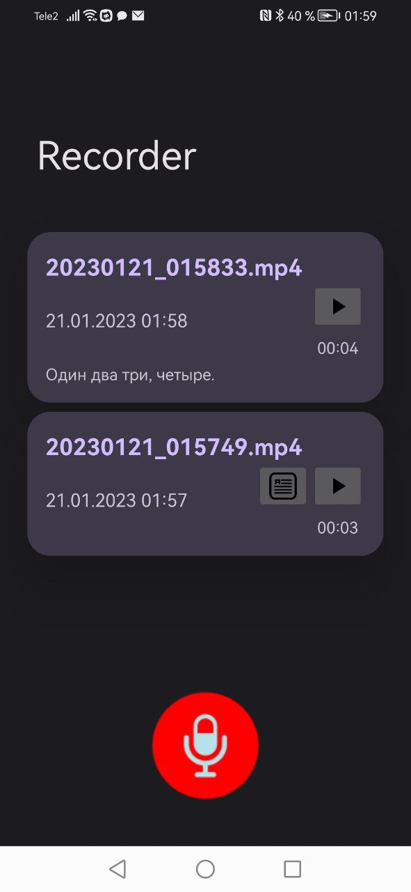

# Диктофон

## Состав группы
| №  | ФИО                           | Группа    |
|----|-------------------------------|-----------|
| 1  | Филатова Анна Александровна   | АСУ-19-1б |
| 2  | Жеребцов Матвей               | РИС-19-1б |

## Описание

### 1. Общий обзор

Приложение "Диктофон", которое позволяет записывать звук с микрофона устройства с последующим переводом записанного звука в текст.

### 2. Особенности
* Запись звука с микрофона
* Прослушивание записанных дорожек
* Перевод речи в текст

### 3. Технические требования
* Приложение должно быть разработано с использованием Android Studio и Java в качестве основного языка программирования
* Приложение должно поддерживать устройства под управлением Android версии 5 (Lollipop) или выше, чтобы обеспечить совместимость с широким спектром устройств

### 4. Функциональные требования
* Запись можно поставить на паузу и продолжить при необходимости
* Приложение должно записывать звук в "фоновом режиме"
* Должен присутствовать перевод речи в текст

### Скриншоты приложения

